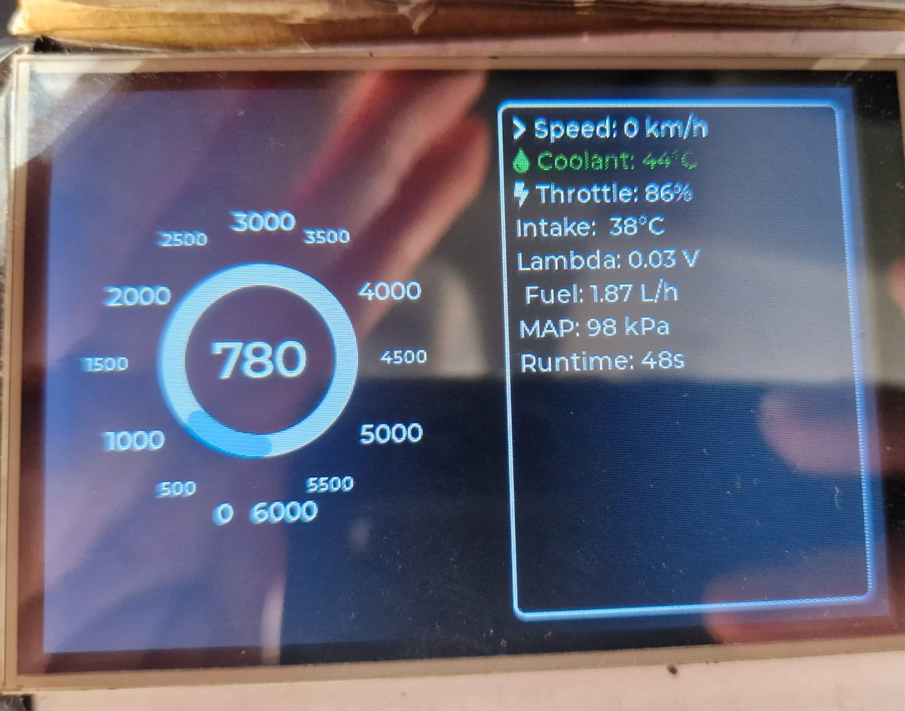
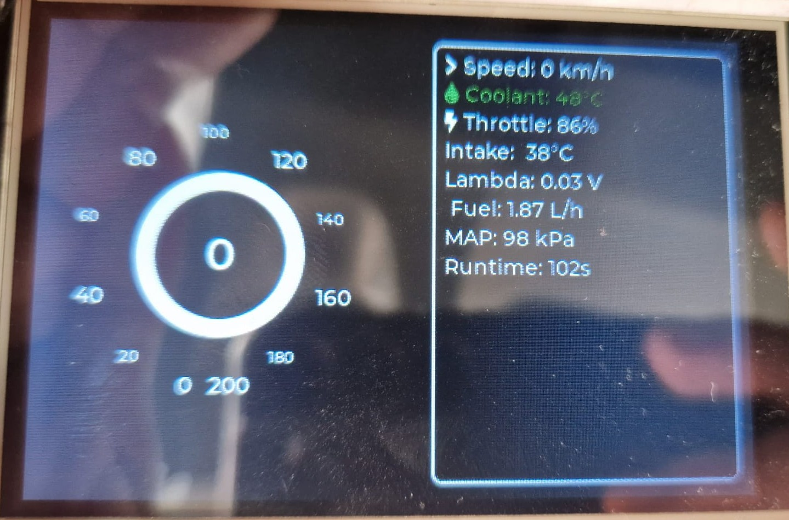
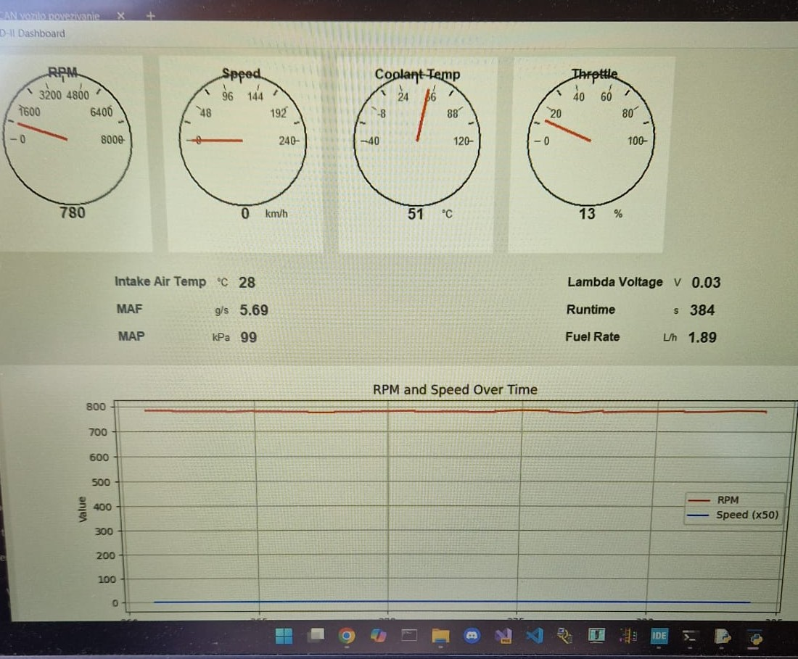

# STM32 OBD-II/CAN Vehicle Diagnostics Dashboard

A standalone embedded vehicle diagnostics system based on an STM32 microcontroller.

The device connects to a vehicle through the EOBD/OBD-II connector, communicates with the ECU over the CAN bus, displays live vehicle data on a TFT screen, and streams the data to a Python dashboard for visualization and CSV logging.

This project was developed as my BSc thesis at the University of Rijeka, Faculty of Engineering.

---

## Project Overview

The goal of this project was to build a small embedded vehicle diagnostic system that can read live engine data directly from a car using the OBD-II/EOBD interface.

The embedded device is based on an STM32L476RG microcontroller. It sends OBD-II Mode 01 PID requests over the CAN bus, receives ECU responses, decodes the data, and displays the values in real time on a 3.5" TFT display using LVGL.

In addition to the embedded display, the system also sends the decoded data over UART / virtual COM port to a Python desktop dashboard, where the values can be visualized and logged to CSV files for later analysis.

---

## System Architecture

```text
Car OBD-II / EOBD Port
        |
        | CAN bus
        v
TJA1051 CAN Transceiver
        |
        v
STM32L476RG
   |              |
   | SPI          | UART / USB Virtual COM Port
   v              v
ILI9488 TFT       Python Dashboard
LVGL GUI          CSV Logger + Live Graphs
```

---

## Features

- Communication with a vehicle ECU over CAN bus
- OBD-II Mode 01 PID requests
- Decoding of live vehicle parameters
- Real-time embedded display using LVGL
- 3.5" ILI9488 TFT display over SPI
- UART / USB virtual COM data streaming
- Python dashboard for live visualization
- CSV logging for later data analysis
- Tested on a Ford Fiesta 2011

---

## Demo

### Embedded TFT dashboard

The embedded device displays live OBD-II data directly on a 3.5" ILI9488 TFT screen using LVGL.


*RPM dashboard view on the embedded TFT display while receiving live OBD-II data.*


*Speed dashboard view on the embedded TFT display.*

### Python dashboard during vehicle testing

The STM32 board streams decoded OBD-II data over UART / virtual COM port to a Python dashboard running on a laptop.


*Python dashboard running on a laptop during vehicle testing.*

---

## Measured / Displayed Parameters

The system can read and display parameters such as:

- Engine RPM
- Vehicle speed
- Coolant temperature
- Intake air temperature
- Throttle position
- Mass Air Flow sensor value
- Manifold Absolute Pressure
- Lambda sensor value
- Engine runtime
- Estimated fuel rate

---

## Hardware Used

- STM32L476RG development board
- TJA1051 CAN transceiver module
- 3.5" ILI9488 TFT display
- OBD-II / EOBD connector
- USB virtual COM port connection to PC

---

## Technologies Used

### Embedded

- C
- STM32 HAL
- STM32CubeIDE
- bxCAN
- UART
- SPI
- LVGL
- ILI9488 TFT display

### PC Dashboard

- Python
- Tkinter
- Matplotlib
- pySerial
- CSV logging

---

## Repository Structure

```text
stm32-obd2-can-dashboard/
│
├── firmware/
│   └── STM32 firmware project
│
├── python-dashboard/
│   ├── obdgauge.py
│   └── log_reader.py
│
├── sample-data/
│   └── example CSV driving logs
│
├── images/
│   └── hardware photos, screenshots and diagrams
│
├── docs/
│   └── additional project notes
│
├── README.md
├── LICENSE
└── .gitignore
```

---

## Python Dashboard

The Python dashboard receives serial data from the STM32 board and visualizes selected vehicle parameters in real time.

It includes:

- analog-style gauges
- live graphs
- serial data parsing
- CSV data logging

The serial logger stores vehicle data such as RPM, speed, coolant temperature, intake temperature, throttle position, MAF, MAP, lambda value, runtime and estimated fuel rate.

---

## Current Repository Status

The project is functional and was tested on a real vehicle.

The repository is currently being cleaned and documented for public release.  
The Python dashboard and sample data are available first, while the STM32 firmware will be added after cleaning unnecessary build files and improving documentation.

---

## Planned Improvements

- Add cleaned STM32 firmware project
- Add wiring diagram
- Add hardware photos
- Add screenshots of the TFT dashboard
- Add screenshots of the Python dashboard
- Add a short demo video
- Improve code comments and documentation
- Add support for more OBD-II PIDs
- Add SD card logging
- Improve enclosure and hardware robustness

---

## Why This Project Matters

This project combines embedded systems, automotive communication, real-time visualization and PC-based data analysis.

It helped me gain practical experience with:

- working close to hardware
- configuring STM32 peripherals
- CAN communication
- OBD-II diagnostics
- embedded GUI development
- serial communication
- Python-based visualization and logging

The project represents my transition from general software development toward embedded systems, automation, robotics and automotive engineering.

---

## License

This project is licensed under the MIT License.
